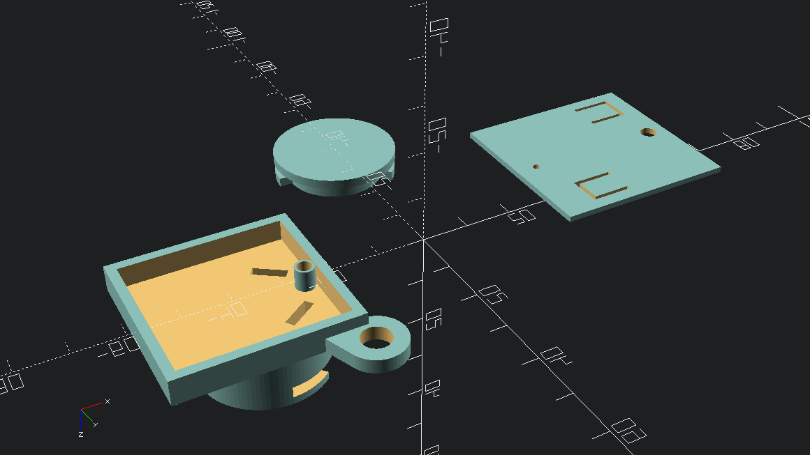

# FAAC-DL2-868SL-Enclosure


**Parametric PCB Enclosure & Integrated Battery Bay**

A professional-grade, parametric **3D-printable enclosure** designed in **OpenSCAD**.
The project integrates:

* a **rectangular PCB compartment**
* a **circular twist-lock (bayonet) battery holder**

Optimized for **CR2032** (and similar coin cells).

---

## 🏗️ Architecturee

The source code is structured according to the **Single Responsibility Principle (SRP)**, with each module handling a single concern.

### Core Modules

* **ArcSector**
  Pure geometric utility for polar-based locking mechanisms.

* **TabCutout**
  Independent module for snap-fit lid retention.

* **MaleBatteryCap / FemaleBatteryBay**
  Decoupled components implementing the bayonet locking system.

* **KeychainModule** *(optional)*
  Structural add-on for keychain or lanyard attachment.

---

## ⚙️ Technical Specifications

### Global Parameters

| Parameter       | Default | Description                                 |
| --------------- | ------- | ------------------------------------------- |
| `batt_dia`      | 21 mm   | Internal diameter for the battery cell      |
| `square_side_x` | 35 mm   | PCB compartment width                       |
| `square_side_y` | 34 mm   | PCB compartment depth                       |
| `wall`          | 3.0 mm  | Structural wall thickness (FDM / SLA)       |
| `clearance`     | 0.3 mm  | Mechanical tolerance for interlocking parts |
| `$fn`           | 100     | Resolution for cylindrical surfaces         |

---

### Mechanical Features

* **Bayonet Lock**
  45° rotation locking system with a 90° guide channel.

* **Cable Routing**
  Integrated **55° angled slots** for wiring cables from batteries

* **Fastening System**
  Built-in **M3 standoffs** for PCB mounting.

---

## 🚀 Getting Started

### Prerequisites

* **OpenSCAD** (latest version recommended for faster rendering).
* **3D printer** calibrated for **0.3 mm tolerances**.

---

## 🛠️ Customization

To adapt the enclosure for a different PCB or battery size, modify the parameters in the header section of the OpenSCAD file.

### Example

```scad
square_side_x = 40; // New PCB width
square_side_y = 40; // New PCB depth
batt_h        = 3.2; // CR2032 height
```

---

## 🖨️ Printing Layout

The script automatically generates **three separate parts**, laid out side-by-side for convenient printing:

1. **Main Chassis**
   PCB tray + female bayonet + optional keychain module

2. **Top Lid**
   Snap-fit protective cover

3. **Battery Cap**
   Male twist-lock bayonet cap

---

## 📌 Notes

* Designed for **parametric reuse** across multiple PCB revisions.
* Compatible with both **FDM** and **SLA** printing workflows.
* Clearances tuned for consumer-grade printers; adjust if using resin or industrial systems.
* I printed it using a Bambulab A1 mini with PETG filament but I think any filament would fit right.
